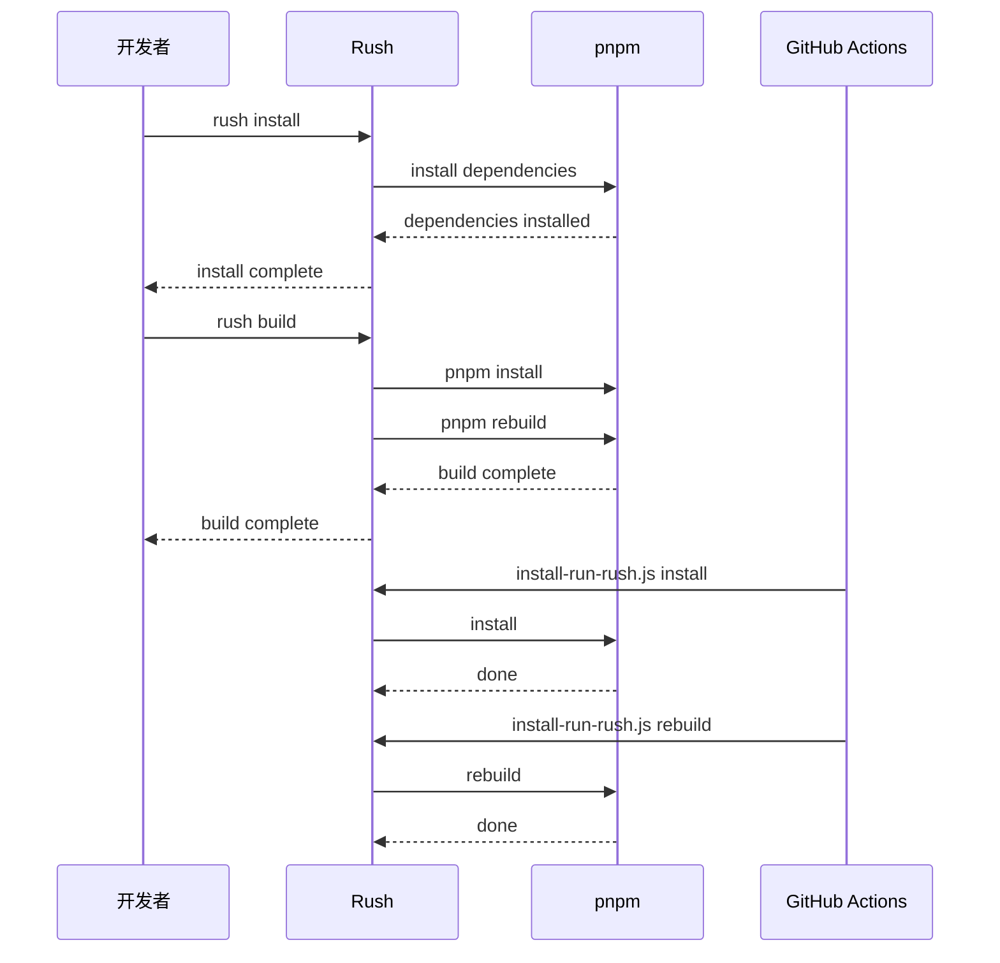
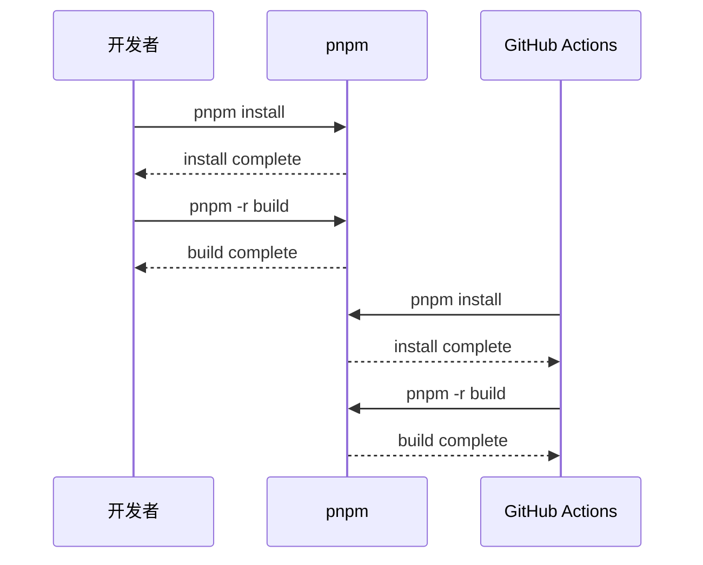

## Context

### 背景

当前项目是一个使用 Rush 管理的 monorepo，但实际上只利用了 Rush 的少量功能（批量脚本执行）。项目本质是一个标准的 pnpm workspace，Rush 的引入增加了不必要的复杂性。

### 当前状态

- **包管理**: Rush 5.149.0 + pnpm 10.3.0
- **项目数量**: 5 个项目（react-app, artusx-api, remix-api, remix-flow, react-component）
- **现有工具链**:
  - rush.json 管理项目依赖和批量操作
  - prettier 用于代码格式化
  - commitlint + git-hooks 用于提交信息校验
  - GitHub Actions CI/CD

### 约束

- 必须保留 pnpm 作为包管理器
- 必须保留私有 npm 仓库配置（位于 `common/config/rush/.npmrc`）
- 必须保留 git hooks 和 commitlint
- 开发者环境需要支持 Node.js >= 20.x

### 相关利益方

- 前端开发者（react-app, react-component）
- 后端开发者（artusx-api, remix-api, remix-flow）
- DevOps（CI/CD 流程维护）

## Goals / Non-Goals

**Goals:**

1. 移除 Rush 依赖，降低工程化复杂度
2. 使用 biome.js 替代 prettier，获得更好的性能和更小的依赖
3. 简化 GitHub Actions 工作流，移除 rush-specific 步骤
4. 保留所有必要的开发工具（git hooks, commitlint）
5. 更新文档反映新的项目结构

**Non-Goals:**

1. 不迁移现有项目的代码或架构
2. 不改变项目的依赖关系或版本
3. 不添加新的功能性依赖
4. 不修改各项目的 package.json 中的脚本（仅更新构建命令）

## Decisions

### Decision 1: 使用 pnpm workspace 替代 Rush

**选择**: 移除 rush.json，直接使用 pnpm-workspace.yaml

**理由**:
- 项目本质上就是一个标准 pnpm workspace，Rush 只是做批量脚本执行
- pnpm workspace 本身支持 `-r` 递归操作，可以实现 `pnpm -r build`
- 减少一个依赖和一个需要学习的工具

**替代方案**:
- 继续使用 Rush: 增加复杂性，无明显收益
- 迁移到 npm workspace: pnpm 性能更好，monorepo 场景不推荐

### Decision 2: 使用 biome.js 替代 prettier

**选择**: 安装 @biomejs/biome，配置 biome.json

**理由**:
- biome.js 使用 Rust 实现，性能比 prettier 快 35 倍
- 内置 linter 和 formatter，减少工具数量
- 单二进制文件，依赖更小

**替代方案**:
- 继续使用 prettier: 需要维护 .prettierrc.js 和 .prettierignore
- ESLint + prettier 组合: 工具数量增加

### Decision 3: 简化 GitHub Actions 工作流

**选择**: 移除 rush-specific 步骤，使用 pnpm 命令

**理由**:
- CI 步骤更简单易读
- 减少对 Rush 安装脚本的依赖
- 构建时间可能略微缩短

**迁移步骤**:
```yaml
# Before
- name: Rush Install
  run: node common/scripts/install-run-rush.js install

# After
- name: Install dependencies
  run: pnpm install
```

### Decision 4: 保留 git hooks、commitlint 和私有 npm 配置

**选择**: 保持 .git/hooks、commitlint.config.js 和 common/config/rush/.npmrc 不变

**理由**:
- git hooks 和 commitlint 是开发者体验的重要组成部分，与 Rush 无关
- .npmrc 包含私有 npm 仓库配置，必须保留

**注意**: common/config/rush/.npmrc 可以选择移动到项目根目录，或保留在原位置（pnpm 支持从多个位置读取配置）

### Decision 5: 移除 rush-related 文件

**选择**: 删除以下文件

| 文件 | 原因 |
|------|------|
| rush.json | 主要 Rush 配置 |
| rush-lock.json | Rush 专用锁文件 |
| common/scripts/install-run*.js | Rush 安装脚本 |
| common/scripts/install-run.js | Rush 核心脚本 |
| .prettierrc.js | Biome 替代 |
| .prettierignore | Biome 替代 |

**注意**: .github/copilot-* 文件在项目中不存在，无需清理。

## Risks / Trade-offs

### Risk 1: 批量操作命令变化
**风险**: 开发者习惯 `rush build` 等命令，需要适应新命令
**缓解**: 更新 CLAUDE.md 和 README.md，提供新命令对照表

### Risk 2: CI/CD 流程验证
**风险**: 简化后的工作流需要实际验证
**缓解**: PR 前在 fork 上测试工作流

### Risk 3: 依赖版本一致性
**风险**: Rush 有 `ensureConsistentVersions` 检查，移除后可能版本不一致
**缓解**: pnpm 本身通过 workspace 机制保证一致性，可选添加 pnpm dedupe

### Risk 4: 回滚复杂度
**风险**: 完整回滚需要恢复多个文件
**缓解**: Git 历史完整，回滚有文档记录

## Migration Plan

### Phase 1: 准备工作
1. 创建 backup 分支（可选）
2. 确认所有更改已提交

### Phase 2: 创建 pnpm-workspace.yaml
```yaml
packages:
  - 'packages/apps/*'
  - 'packages/libs/*'
```
如果项目结构不同，按实际情况调整。

### Phase 3: 安装 biome.js
```bash
pnpm add -D @biomejs/biome
pnpm biome init
```
生成 biome.json 配置文件。

### Phase 4: 更新 package.json scripts
将所有 `rush` 相关命令替换为 `pnpm -r`：
- `rush build` → `pnpm -r build`
- `rush update` → `pnpm -r update`
- 其他类推

### Phase 5: 更新 GitHub Actions
修改 `.github/workflows/ci.yml`，移除 Rush 特定步骤。

### Phase 6: 清理文件
删除 Rush 相关文件（rush.json, rush-lock.json, common/scripts/install-run*.js, .prettierrc.js, .prettierignore）。

### Phase 7: 更新文档
- 更新 CLAUDE.md 中的命令
- 更新 README.md（如有）

### Phase 8: 验证
1. 本地运行 `pnpm install`
2. 运行 `pnpm -r build`
3. 提交更改，验证 CI

### Rollback
如需回滚，执行以下步骤：

```bash
# 1. 恢复 Rush 配置
git checkout HEAD -- rush.json rush-lock.json

# 2. 恢复 Rush 脚本
git checkout HEAD -- common/scripts/

# 3. 恢复 prettier 配置
git checkout HEAD -- .prettierrc.js .prettierignore

# 4. 恢复 package.json scripts
git checkout HEAD -- package.json

# 5. 恢复 GitHub Actions
git checkout HEAD -- .github/workflows/

# 6. 重新安装依赖
rush install
```

## Open Questions

1. **common/autoinstallers 目录**: 包含 Rush 的 autoinstallers，需要检查是否删除
2. **common/config 目录**: 用途不明，需要确认是否保留
3. **pnpm-workspace.yaml 路径**: 需要确认正确的 packages 路径（当前项目结构为 packages/apps/* 还是其他）
4. **biome.json 配置**: 是否需要自定义格式化规则，还是使用默认配置

---

## Sequence Diagram: 迁移前后对比

### 迁移前 (使用 Rush)



### 迁移后 (使用纯 pnpm)



### 关键差异

| 方面 | Rush | pnpm-only |
|------|------|-----------|
| 安装命令 | `rush install` | `pnpm install` |
| 构建命令 | `rush build` | `pnpm -r build` |
| CI 步骤数 | 4 步 | 2 步 |
| 依赖 | Rush + pnpm | 仅 pnpm |
