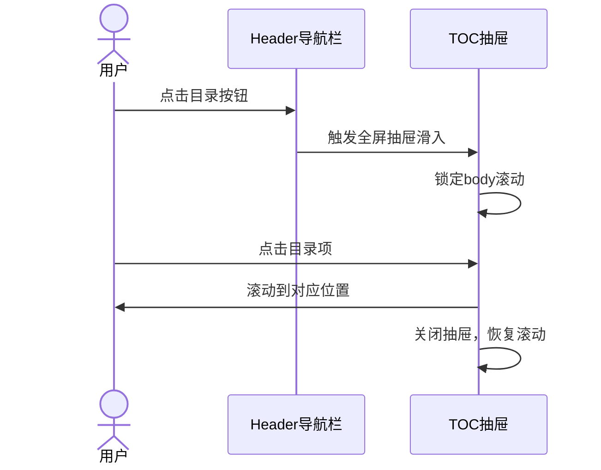

## Context

当前 docs-app 使用 React Router v7 + Tailwind CSS，TOC 组件在桌面端显示为右侧 sticky 侧边栏，移动端使用固定在底部右侧的浮动按钮触发折叠面板。

**当前移动端 TOC 实现：**
- 浮动按钮位置：`fixed bottom-4 right-4`
- 面板高度限制：`max-h-64`（256px）
- 面板溢出处理：`overflow-y-auto`
- 面板最大宽度：`max-w-xs`

**问题分析：**
1. 256px 高度对于长文档（如 TSLA 分析报告有 7 个一级标题）不足以完整显示
2. 用户必须在狭小区域内滚动，体验不佳
3. 面板固定在底部，可能遮挡内容或与其他元素冲突

## Goals / Non-Goals

**Goals:**
- 提升移动端 TOC 面板高度，确保目录可完整显示
- 提供更合理的滚动体验（全屏展示而非固定像素限制）
- 保持桌面端现有布局不变（lg 断点以上）

**Non-Goals:**
- 不改变 TOC 数据结构或生成逻辑
- 不添加新的导航功能（如搜索、过滤）
- 不影响平板端体验（sm/md 断点）

## Decisions

### Decision 1: 移动端 TOC 展示方式

**选择：全屏抽屉（Drawer）从右侧滑入**

**理由：**
- 全屏展示可以完整显示所有目录项，无需在小区域内滚动
- 从右侧滑入是移动端常见的导航模式，用户熟悉
- 无遮罩层，界面简洁，用户可快速定位

**替代方案考虑：**
- `max-h-[70vh]` 顶部下拉面板：仍需在面板内滚动，体验不佳
- 底部浮动面板：位置突兀，遮挡内容

### Decision 2: TOC 按钮位置

**选择：通过 Portal 渲染到 Header 导航栏 slot**

**理由：**
- Header 导航栏是用户寻找导航功能的首选位置
- 与 GitHub 链接并列，视觉统一
- 仅在移动端显示（`lg:hidden`）

**替代方案考虑：**
- 固定定位按钮：位置不统一，与导航栏脱节
- 文章标题旁按钮：视觉干扰

### Decision 3: Drawer Header 高度

**选择：与 Header 导航栏高度一致（h-14 = 56px）**

**理由：**
- 视觉一致性，Drawer header 与页面 Header 对齐
- 图标尺寸统一（h-4 w-4）
- 标题字体统一（text-sm）

## Risks / Trade-offs

| 风险 | 缓解措施 |
|------|----------|
| 全屏遮挡内容 | 无遮罩层，点击目录项后立即关闭跳转 |
| Portal 渲染时机 | 使用 mounted 状态确保客户端渲染 |
| Header slot 空元素 | 使用 `flex items-center` 确保对齐 |

## Implementation Approach

## Final Implementation

- **按钮位置**：Header 导航栏右侧，通过 `createPortal` 渲染到 `#header-toc-slot`
- **展示方式**：全屏抽屉（`w-full`）从右侧滑入，无遮罩层
- **Header 高度**：`h-14`（56px），与页面 Header 一致
- **动画**：`transition-transform duration-300 ease-in-out`