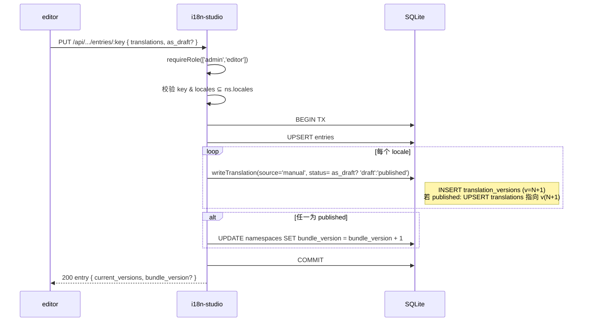
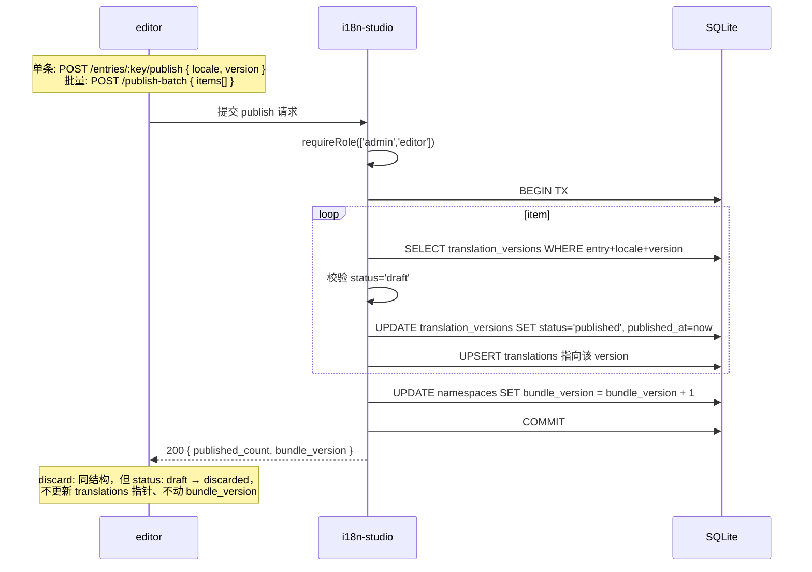
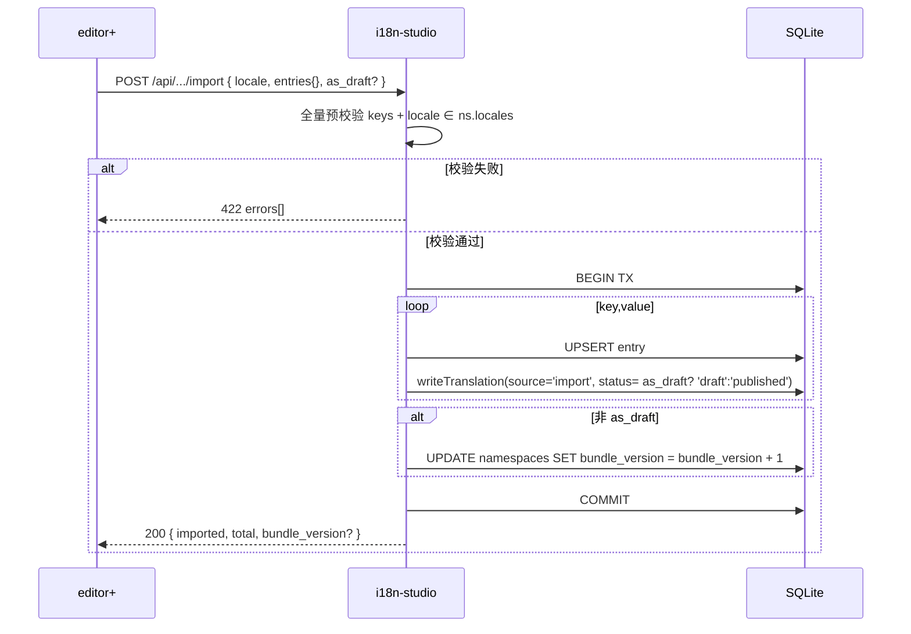
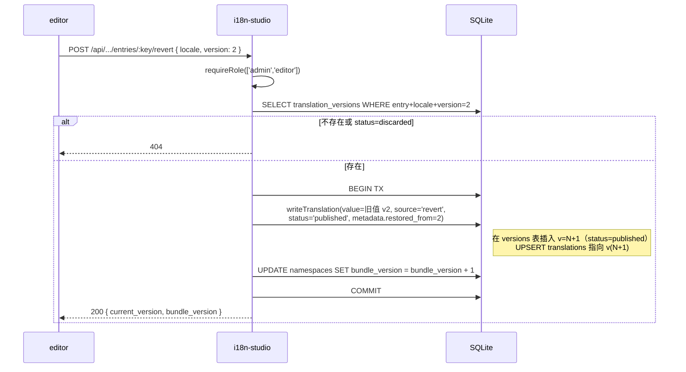
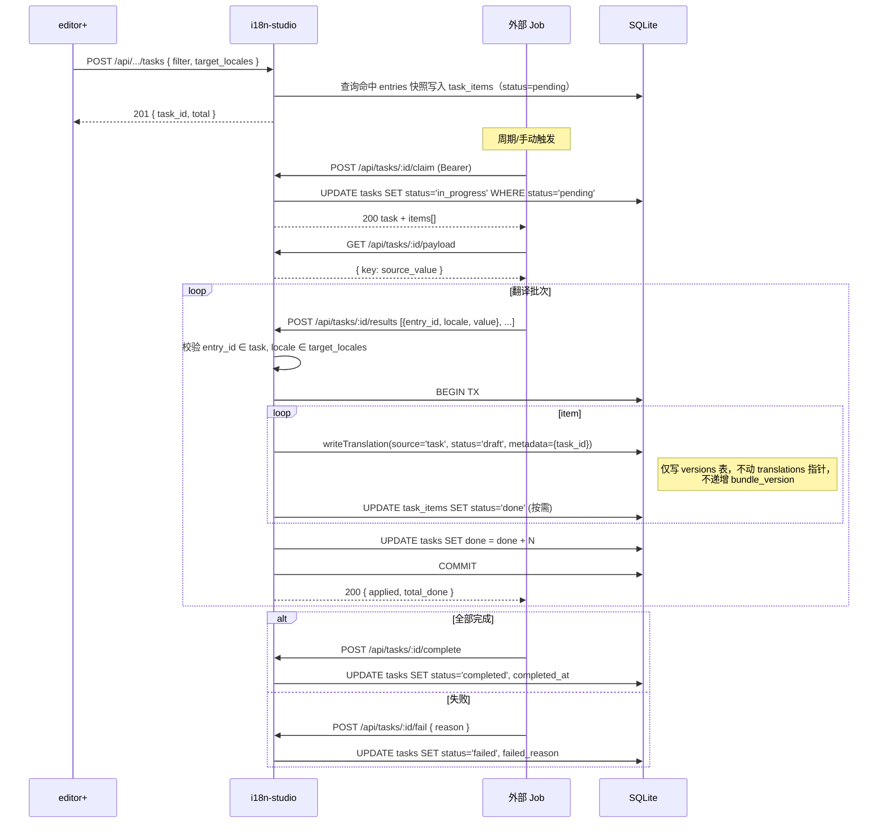
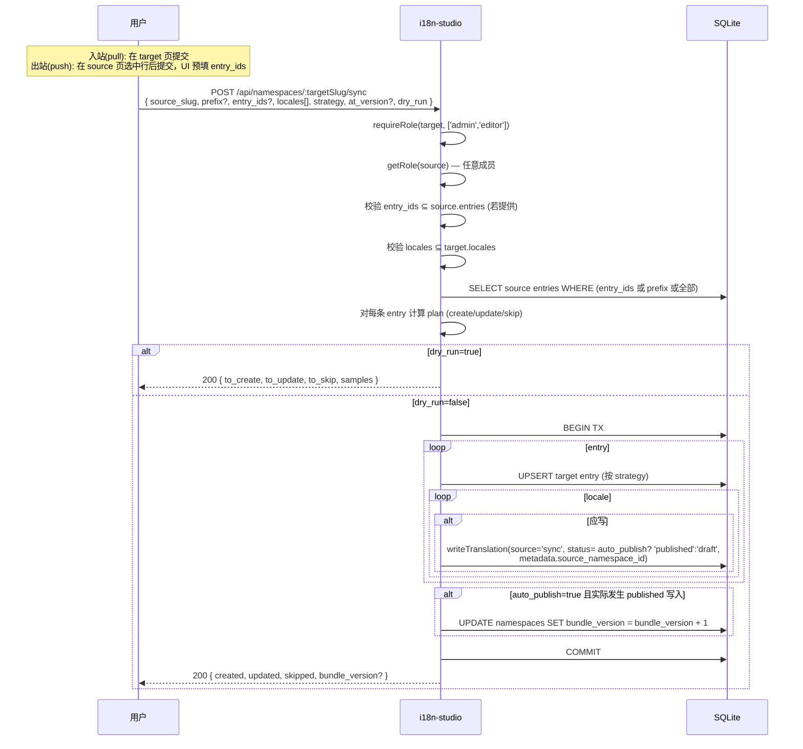
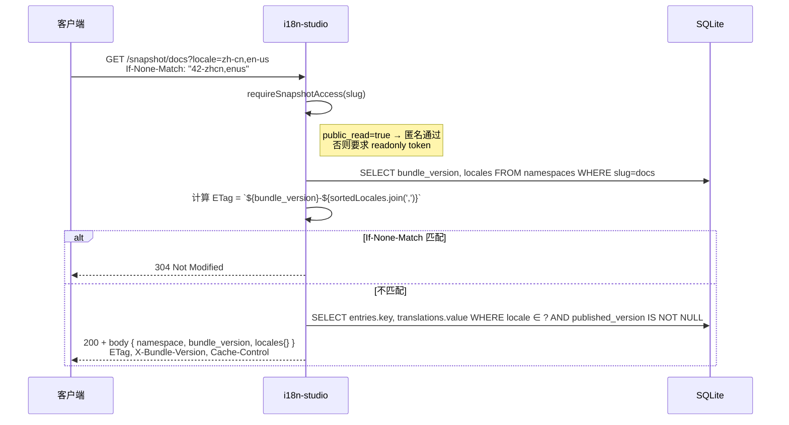

## Context

仓库现有应用包括 `artusx-api`（Node.js + ArtusX + Sequelize）、`remix-api`（Cloudflare Workers + Hono + Supabase）、`react-app`（React Router v7 + Vite）、`docs-app`（React Router v7）。当前没有统一的多语言词条管理能力。

用户要求**新建独立 app**，采用 **React Router v7 全栈 + SQLite**。React Router v7 已在 `react-app` / `docs-app` 中验证可行（`@react-router/node` + `react-router-serve`），团队熟悉度高；SQLite + Drizzle 适合小团队自托管，零外部依赖。

## Goals / Non-Goals

**Goals:**

- 新增独立 app `packages/apps/i18n-studio`，单仓 + workspace 内运行
- React Router v7 同 codebase 同时承载后端（loaders/actions/resource routes）与前端（路由组件 + shadcn/ui）
- SQLite + Drizzle ORM：表结构清晰、迁移可重复、本地开发零配置
- 默认 `zh-cn / zh-tw / en-us`；命名空间管理员可追加 BCP-47 风格 locale
- flat key（含 `.` 段层级）+ 词条 CRUD + 批量导入/导出
- 用户—命名空间多对多 + admin/editor/viewer 角色与权限矩阵
- 输入校验：locale `^[a-z]{2,3}(-[a-z]{2,4})?$`、key 段 `[a-zA-Z0-9_-]+`
- **翻译版本控制**：每次写入生成 append-only 历史记录，支持查看/回滚
- **批量翻译任务契约**：仅做存储 + 状态机 + claim/写回 API，不内建翻译执行器
- **跨命名空间同步**：一次性拷贝（非订阅），支持 dry-run 与冲突策略

**Non-Goals:**

- 翻译质量评估、术语库
- **不内建任何翻译执行器**（机器翻译、人工翻译平台对接）；仅保留任务存储与回写 API
- 多租户云部署、SSO 集成（首版用本地用户表 + 简单凭证）
- 缺失翻译的自动 fallback（消费方决定）
- 实时协同编辑（多人同时编辑走最后写入胜出 + 版本号 ETag 提示）
- 跨空间**持续订阅同步**（首版仅一次性同步）

## Decisions

### 决策 1：技术栈 React Router v7 全栈 + Vite

- **采用** React Router v7（与 `react-app` 一致），`@react-router/node` + `react-router-serve` 部署
- 后端逻辑写在 `app/routes/**/*.tsx` 的 `loader` / `action`，资源端点写在 `app/routes/api.*.tsx`（返回 JSON）
- 前端 UI 与后端共享 TypeScript 类型，避免接口漂移
- **替代**：Hono 单独后端 + 独立 SPA 前端。**否决**：双进程、双部署、类型不共享，无收益

### 决策 2：SQLite via better-sqlite3 + Drizzle ORM

- **采用** `better-sqlite3`（同步、稳定、无 native fork 问题）+ `drizzle-orm` + `drizzle-kit`（迁移）
- 数据文件位置：`data/i18n.db`（dev / 自托管），生产可挂载持久卷
- 启动时自动跑 `drizzle-kit migrate` 应用 SQL 迁移
- WAL 模式开启以减小写锁冲突
- **替代**：A) `prisma`：体量大、生成器流程重；B) `libsql/turso`：引入网络/账号；C) Sequelize：与现有栈一致但 SQLite 体验弱
- **选择 Drizzle**：类型最强、SQL 透明、适合 SQLite

### 决策 3：身份与会话采用本地用户表 + cookie session

- 引入 `users` 表（id、email、password_hash、display_name），使用 `argon2`（或 `bcryptjs`）哈希
- 会话使用 React Router `createCookieSessionStorage`（`secure`、`httpOnly`、`sameSite=lax`）
- 登录/登出/注册（首位用户自动成为系统超管）
- **非目标**：OAuth / SSO（v2 再扩展）
- **替代**：完全无认证，仅依赖前置网关。**否决**：本应用要求多用户协作，必须有用户标识来挂成员关系

### 决策 4：数据模型

```
users
  id            TEXT PRIMARY KEY  -- ulid
  email         TEXT UNIQUE NOT NULL
  password_hash TEXT NOT NULL
  display_name  TEXT
  created_at    INTEGER NOT NULL  -- unix ms
  updated_at    INTEGER NOT NULL

namespaces
  id              TEXT PRIMARY KEY
  slug            TEXT UNIQUE NOT NULL
  name            TEXT NOT NULL
  default_locale  TEXT NOT NULL DEFAULT 'zh-cn'
  locales         TEXT NOT NULL    -- JSON: ["zh-cn","zh-tw","en-us"]
  public_read     INTEGER NOT NULL DEFAULT 0   -- 0=私有, 1=允许匿名读取 /snapshot
  bundle_version  INTEGER NOT NULL DEFAULT 0   -- 每次 published 集合变更后 +1
  created_at      INTEGER NOT NULL
  updated_at      INTEGER NOT NULL
  created_by      TEXT NOT NULL    -- users.id

memberships
  id           TEXT PRIMARY KEY
  namespace_id TEXT NOT NULL REFERENCES namespaces(id) ON DELETE CASCADE
  user_id      TEXT NOT NULL REFERENCES users(id) ON DELETE CASCADE
  role         TEXT NOT NULL CHECK (role IN ('admin','editor','viewer'))
  created_at   INTEGER NOT NULL
  updated_at   INTEGER NOT NULL
  UNIQUE (namespace_id, user_id)

entries
  id           TEXT PRIMARY KEY
  namespace_id TEXT NOT NULL REFERENCES namespaces(id) ON DELETE CASCADE
  key          TEXT NOT NULL          -- flat: 'home.title'
  description  TEXT
  created_at   INTEGER NOT NULL
  updated_at   INTEGER NOT NULL
  updated_by   TEXT NOT NULL
  UNIQUE (namespace_id, key)

translations
  id              TEXT PRIMARY KEY
  entry_id        TEXT NOT NULL REFERENCES entries(id) ON DELETE CASCADE
  locale          TEXT NOT NULL
  value           TEXT NOT NULL          -- 当前 published 翻译值（缓存自 published 版本，加快查询）
  published_version INTEGER              -- 当前生效版本号；NULL 表示该 (entry, locale) 尚无 published（仅有 draft）
  updated_at      INTEGER NOT NULL
  updated_by      TEXT NOT NULL
  UNIQUE (entry_id, locale)

translation_versions
  id              TEXT PRIMARY KEY
  entry_id        TEXT NOT NULL REFERENCES entries(id) ON DELETE CASCADE
  locale          TEXT NOT NULL
  version         INTEGER NOT NULL          -- 单调递增，按 (entry_id, locale) 分配
  value           TEXT NOT NULL
  source          TEXT NOT NULL CHECK (source IN ('manual','import','task','sync','revert'))
  status          TEXT NOT NULL CHECK (status IN ('draft','published','discarded')) DEFAULT 'draft'
  actor_id        TEXT NOT NULL             -- 写入者 user_id 或 worker_id
  metadata        TEXT                      -- JSON: { task_id?, source_namespace_id?, restored_from? }
  created_at      INTEGER NOT NULL
  published_at    INTEGER                   -- 进入 published 的时间（可后于 created_at）
  UNIQUE (entry_id, locale, version)

translation_tasks
  id              TEXT PRIMARY KEY
  namespace_id    TEXT NOT NULL REFERENCES namespaces(id) ON DELETE CASCADE
  status          TEXT NOT NULL CHECK (status IN ('pending','in_progress','completed','failed','cancelled'))
  target_locales  TEXT NOT NULL             -- JSON array
  filter          TEXT NOT NULL             -- JSON: { prefix?, missing_locale? }
  total           INTEGER NOT NULL
  done            INTEGER NOT NULL DEFAULT 0
  created_by      TEXT NOT NULL
  worker_id       TEXT                      -- 由 claim 写入
  started_at      INTEGER
  completed_at    INTEGER
  failed_reason   TEXT
  created_at      INTEGER NOT NULL
  updated_at      INTEGER NOT NULL

translation_task_items
  id           TEXT PRIMARY KEY
  task_id      TEXT NOT NULL REFERENCES translation_tasks(id) ON DELETE CASCADE
  entry_id     TEXT NOT NULL REFERENCES entries(id) ON DELETE CASCADE
  key          TEXT NOT NULL                  -- 快照（防止 key 改动）
  source_locale TEXT NOT NULL                 -- 任务创建时确定的源语言（默认 namespace.default_locale）
  source_value  TEXT NOT NULL                 -- 创建时快照
  status       TEXT NOT NULL CHECK (status IN ('pending','done')) DEFAULT 'pending'
  UNIQUE (task_id, entry_id)

api_tokens
  id              TEXT PRIMARY KEY
  namespace_id    TEXT NOT NULL REFERENCES namespaces(id) ON DELETE CASCADE
  name            TEXT NOT NULL
  scope           TEXT NOT NULL CHECK (scope IN ('task','readonly'))
                    -- task: 翻译任务 claim/results 等管理 API
                    -- readonly: 仅可读 /snapshot/...，不可写、不可访问 /api/...
  token_hash      TEXT NOT NULL                -- 明文仅创建时返回一次
  token_prefix    TEXT NOT NULL                -- 前 6 字符明文，用于 UI 列表识别
  created_by      TEXT NOT NULL
  created_at      INTEGER NOT NULL
  revoked_at      INTEGER
```

附加索引：
- `entries(namespace_id, key)`（unique 已含）
- `entries(namespace_id, key COLLATE NOCASE)` 用于前缀搜索（按需）
- `translations(entry_id)`、`memberships(user_id)`
- `translation_versions(entry_id, locale, version desc)` 用于历史查询
- `translation_tasks(namespace_id, status, created_at desc)` 用于列表
- `translation_task_items(task_id, status)` 用于回写

**替代**：把翻译塞进 `entries.translations JSON`。**否决**：批量按 locale 查/导入冲突大，唯一约束难做。

### 决策 5：flat key 校验规则

- 整体正则：`^[a-zA-Z0-9_-]+(\.[a-zA-Z0-9_-]+)*$`
- 拒绝：空白、首尾点、连续点、非允许字符
- key 长度 ≤ 255，段数 ≤ 10（防止异常深度）
- 错误信息精确到段（"第 3 段 `foo bar` 含空白"）

### 决策 6：locale 校验规则

- 正则：`^[a-z]{2,3}(-[a-z]{2,4})?$`，全部小写
- 默认 `['zh-cn', 'zh-tw', 'en-us']`，`zh-cn` 为默认 fallback 标识
- 写入 `namespaces.locales` 前去重并校验每一项

### 决策 7：权限实现

管理 API 与快照通道分两条认证链路，所有 loader/action 起手必须显式调用对应 helper：

- **管理 API（`/api/...`）**：`requireUser(request)`（cookie session）+ `requireRole(request, slug, allowedRoles[])`
  - viewer 写操作 → 403
  - 非成员一律 → 404（避免存在性嗅探）
  - 来访请求若仅携带 `Authorization: Bearer <token>` 而无 cookie session：仅当 path 为 `/api/tasks/:id/{claim,results,complete,fail,payload}` 且 token `scope='task'` 时放行；其它 `/api/...` 一律 401
- **任务回写（`/api/tasks/:id/...`）**：`requireApiToken(request, scope='task')` → 拿到 token.namespace_id → 校验 task 属于同一 namespace；不接受 cookie session
- **快照通道（`/snapshot/...`）**：`requireSnapshotAccess(request, slug)`：
  - 若 `namespace.public_read=true`：放行匿名
  - 否则：要求 `Authorization: Bearer <token>` 且 token `scope='readonly'`、`namespace_id=ns.id`、未撤销
  - **永不**接受 cookie session（避免被浏览器附带；管理员看消费视图请走 `/api/.../export`）
  - 私有命名空间无凭证一律 401，且响应不区分"namespace 不存在"与"未授权"

不变量在 service 层强制：
- "至少 1 个 admin" 在 `MembershipService.updateRole / remove` 单事务校验
- "scope=readonly token 不可调用 /api/..." 由路由层中间件强制（接受 token 后再按 scope 分支）
- "scope=task token 不可调用 /snapshot/..." 同理

### 决策 8：批量导入策略

- 全量预校验（key + locale 集合 ⊆ namespace.locales）
- `db.transaction(() => { ... })` 内 upsert
- 单批 ≤ 10,000 key，超出 422 拒绝
- 导入失败响应 `{ errors: [{ key, reason }] }`

### 决策 9：路由与 API 设计

UI 路由（`app/routes/`）：

- `_index.tsx` — 命名空间列表（要求登录）
- `login.tsx` / `register.tsx` / `logout.tsx`
- `ns.$slug._index.tsx` — 命名空间概览
- `ns.$slug.entries.tsx` — 词条编辑页（虚拟列表 + 表格 + 翻译编辑面板 + 行内历史抽屉 + 批量选择 → 创建任务）
- `ns.$slug.entries.$key.history.tsx` — 翻译历史与回滚
- `ns.$slug.tasks.tsx` — 翻译任务列表（创建、查看、取消、查看回写）
- `ns.$slug.members.tsx` — 成员管理（admin 可见）
- `ns.$slug.settings.tsx` — 语言/名称配置（admin 可见）
- `ns.$slug.sync.tsx` — 跨空间同步对话框（选择目标、策略、预览）

JSON 资源路由（`app/routes/api.*.tsx`，loader/action 返回 `Response.json`）：

```
POST   /api/namespaces                              已登录
GET    /api/namespaces                              已登录
PATCH  /api/namespaces/:slug                        ns.admin
                                                    body: { name?, default_locale?, locales?, public_read? }
DELETE /api/namespaces/:slug                        ns.admin
POST   /api/namespaces/:slug/members                ns.admin
PATCH  /api/namespaces/:slug/members/:userId       ns.admin
DELETE /api/namespaces/:slug/members/:userId       ns.admin
GET    /api/namespaces/:slug/entries?prefix=&view=all&locale=&at_version=&group=key|locale&include=&status=&page=&cursor=  ns.member
GET    /api/namespaces/:slug/entries/:key          ns.member
PUT    /api/namespaces/:slug/entries/:key          ns.editor+   body: { description?, translations: {locale: value}, as_draft? }
DELETE /api/namespaces/:slug/entries/:key          ns.editor+
GET    /api/namespaces/:slug/export?locale=&at_version=        ns.member
POST   /api/namespaces/:slug/import                 ns.editor+   body: { locale, entries{}, as_draft? }

# 版本控制 + 草稿/发布
GET    /api/namespaces/:slug/entries/:key/versions?locale=&limit=&cursor= ns.member
POST   /api/namespaces/:slug/entries/:key/revert   ns.editor+   body: { locale, version }
POST   /api/namespaces/:slug/entries/:key/publish  ns.editor+   body: { locale, version }
POST   /api/namespaces/:slug/entries/:key/discard  ns.editor+   body: { locale, version }
POST   /api/namespaces/:slug/publish-batch          ns.editor+   body: { items: [{ entry_id|key, locale, version }] }

# 翻译任务（外部 job 通过 scope=task token 访问）
POST   /api/namespaces/:slug/tasks                  ns.editor+   body: { filter?, entry_ids?[], target_locales[], source_locale? }
GET    /api/namespaces/:slug/tasks?status=          ns.member
GET    /api/namespaces/:slug/tasks/:id              ns.member
DELETE /api/namespaces/:slug/tasks/:id              ns.admin     取消
POST   /api/tasks/:id/claim                          token(task) + ns.member   外部 job 认领
POST   /api/tasks/:id/results                        token(task) + ns.member   外部 job 回写翻译批次（写入为 draft）
POST   /api/tasks/:id/complete                       token(task) + ns.member
POST   /api/tasks/:id/fail                           token(task) + ns.member
GET    /api/tasks/:id/payload                        token(task) + ns.member   下载任务 items（供 job 消费）

# 跨空间同步（同一 endpoint 处理 pull/push 两种入口）
POST   /api/namespaces/:targetSlug/sync             ns.editor+ on target
                                                    body: { source_slug, prefix?, entry_ids?[], locales[], strategy, at_version?, auto_publish?, dry_run? }

# API token 管理（含 task / readonly 两种 scope）
GET    /api/namespaces/:slug/tokens                  ns.admin   列出（含 prefix、scope、created_at、revoked_at）
POST   /api/namespaces/:slug/tokens                  ns.admin   body: { name, scope: 'task'|'readonly' }；明文仅返回一次
DELETE /api/namespaces/:slug/tokens/:id              ns.admin   撤销

# 客户端快照通道（独立路径，不挂 /api/，仅 published）
GET    /snapshot/:slug?locale=a,b&bundle_version=N   匿名（若 public_read=true） 或 token(readonly)
GET    /snapshot/:slug/:locale?bundle_version=N      同上；单 locale 直接 flat JSON，bundle_version 走 X-Bundle-Version 响应头
```

UI 优先用 form/action 调用，外部消费方走 `/api/*`；同一 service 层共享。

### 决策 10：翻译版本控制 + 草稿/发布工作流

- **append-only 历史**：`translation_versions` 永不更新已有行的 `value`；可更新 `status`（draft → published / draft → discarded）
- **`translations` 是缓存视图**：保存 published 版本的 `value` 与 `published_version`，仅为加速默认查询；首次创建若仅有 draft，`translations` 行可为空缺或 `published_version=NULL`
- **写入路径统一**：所有写入都走 `entryService.writeTranslation({ entryId, locale, value, source, actorId, status, metadata })`：
  - 在 `translation_versions` 插入新行（version = max(prev)+1）
  - 若 `status='published'`：同步更新 `translations.value / published_version`，同时把当前 (entry, locale) 之前的 `published` 历史行 status 不变（保留 history），但 `translations` 指针只指向最新一条
  - 单事务执行
- **写入 `source` 枚举**：`manual` / `import` / `task` / `sync` / `revert`
- **状态枚举**：
  - `draft`：默认状态（task / sync 写入；用户显式 `as_draft=true`）
  - `published`：用户显式发布；UI 编辑保存默认 published（除非 `as_draft=true`）
  - `discarded`：被 discard 的 draft，永不可再 publish；保留作为历史
- **API**：
  - `POST /api/.../entries/:key/publish` — `body: { locale, version }` 单条 publish
  - `POST /api/.../publish-batch` — `body: { items: [{ entry_id|key, locale, version }] }` 批量 publish（事务）
  - `POST /api/.../entries/:key/discard` — `body: { locale, version }` 丢弃 draft
- **Publish 操作语义**：
  - 仅允许把 `draft` 改为 `published`；对 `discarded` 拒绝
  - 多 draft 同 (entry, locale) 时，publish 较老的 draft 也合法（用户手动选择）；其他更高版本号的 draft 保持 draft
  - 不重新分配版本号（保留原 version，只翻 status）
- **回滚**：读历史行 → 调用 `writeTranslation({ source='revert', status='published', metadata.restored_from=<old_version> })` 写入新版本号
- **历史查询**分页：按 `(entry_id, locale)` + `version desc`，cursor = 上一页最末 version；响应中标识 `current_published_version`
- **替代**：A) 不缓存 published 到 `translations`：每次默认查询都做子查询，写少读多场景下浪费；B) 用单 `translations.status` 列与"覆盖历史"：丢失 draft 与 published 共存能力，否决
- **代价**：写入路径双表更新；publish 多一次 update；可接受
- **版本号 / status / bundle_version 行为对照**：

  | 动作 | translation_versions | translations 指针 | bundle_version |
  | --- | --- | --- | --- |
  | 直接编辑 (`as_draft=false`) | 新行 v=N+1, status=published | 指向 v(N+1) | +1 |
  | 直接编辑 (`as_draft=true`) | 新行 v=N+1, status=draft | 不变 | 不变 |
  | 批量导入（默认 published） | 每条新行 v=N+1, status=published | 各自指向新版本 | +1（整次操作） |
  | 任务回写（task） | 新行 v=N+1, status=draft | 不变 | 不变 |
  | 跨空间同步（默认） | 新行 v=N+1, status=draft | 不变 | 不变 |
  | 跨空间同步 (`auto_publish=true`) | 新行 v=N+1, status=published | 指向新版本 | +1（整次操作） |
  | publish v=K（K≤N） | 不插行；v=K 由 draft → published；其它 published 行 status 保留为历史标记位 | 指向 v=K | +1 |
  | 批量 publish N 条 | 同上，多行各自翻 status | 各自指向 | +1（共用） |
  | discard v=K | v=K 由 draft → discarded | 不变 | 不变 |
  | revert 到 v=K | 新行 v=N+1, value 取自 v=K, status=published, metadata.restored_from=K | 指向 v(N+1) | +1 |
  | 删除词条（含 published） | 行随 entry cascade（archived 视实现） | — | +1 |
  | 删除词条（仅 draft） | 同上 | — | 不变 |

### 决策 11：翻译任务契约（不内建执行器）

- **本应用职责**：存储任务、状态机、`claim`/`results`/`complete`/`fail` 接口、`payload` 下载、回写校验与版本生成
- **本应用不做**：不发起任何机器翻译调用、不轮询第三方、不实现 worker；外部 job 在自己的进程/仓库中实现
- **状态机**：`pending → in_progress → completed | failed | cancelled`，单向不可回退
- **认领**：单 worker，不支持并发认领同任务（首版）；`claim` 是 `UPDATE ... WHERE status='pending'` 的乐观锁，影响行数 != 1 即拒
- **API token**：`api_tokens` 表（见数据模型），有两种 scope：
  - `scope='task'`：用于翻译任务 `claim / results / complete / fail / payload`，必须属于具体 namespace（`namespace_id` 必填），不可访问 `/snapshot/...`
  - `scope='readonly'`：用于 `/snapshot/:slug` 私有命名空间访问，不可访问任何 `/api/...`；持有者无需是命名空间成员
  - token 头 `Authorization: Bearer <token>`；明文仅创建时返回一次，DB 仅存 hash + 前 6 位 `token_prefix` 用于 UI 列表识别
  - admin 可撤销（写入 `revoked_at`，不物理删除）
- **回写校验**：`entry_id` ∈ task.items、`locale` ∈ `task.target_locales`、值非超长；任一失败整批 422；逐项写入用 `writeTranslation(source='task', status='draft', metadata={task_id})`，不直接发布
- **payload 输出**：flat JSON `{ key: source_value }`，便于工具直接消费
- **替代**：A) 把 task = 一组 webhook 触发外部服务：耦合外部接口形态；B) 走消息队列：引入 broker。**否决**：拉模型最简单、最贴合 SQLite 自托管定位

### 决策 12：跨命名空间同步

- **一次性、显式触发**：不是订阅；用户每次 UI/API 触发一次同步，不维护源-目标关系
- **两种入口共享同一 API**：
  - **入站（pull）**：当前打开 `/ns/:slug/sync`，向当前 ns 写入；当前 ns 是目标
  - **出站（push）**：在 entries 页选中行后批量推送到其它 ns；当前 ns 是源，目标由用户选择
  - 服务端不区分两种"方向"，统一抽象为 `{ source_slug, target_slug, ... }`；UI 只是预填字段
- **范围参数（互斥或叠加）**：
  - `prefix` — 按 key 前缀过滤源词条
  - `entry_ids` — 显式 entry id 白名单（用于 push 选中行场景）；MUST 全部属于源命名空间
  - 同时给 `prefix` 与 `entry_ids` 时取交集（即在白名单中且匹配前缀）
  - 都不给 → 同步源命名空间所有词条
- **strategy 三档**：
  - `skip`：源有目标无 → 创建；都有 → 跳过整 entry（不动 translations）
  - `overwrite`：所有命中 entry 的 locales 子集都强制覆盖
  - `fill_missing`：仅在目标 entry 缺该 locale 时才写入
- **dry_run**：在事务中模拟（`BEGIN; ... ROLLBACK`）或纯计算后回滚，返回 `{ to_create, to_update, to_skip, samples[] }`
- **写入语义**：所有实际写入走 `writeTranslation(source='sync', status='draft', metadata={ source_namespace_id })` 生成版本；**不直接发布**
- **`auto_publish` 选项**：请求带 `auto_publish=true` 时，写入时直接 `status='published'`；语义等同"先 draft 后立即批量 publish"
- **权限**：源仅需读权限（任意成员），目标需 editor+；`auto_publish=true` 不额外升级，editor 即可
- **替代**：A) 持续订阅同步：复杂度高、冲突语义难定；B) 仅完整复制（不允许子集）：灵活性差。**否决**：v1 一次性 + 子集（prefix / 白名单） + 策略足够

### 决策 13：词条查询视图与版本快照

- **统一查询**：以 `GET /api/namespaces/:slug/entries` 为单入口，支持下列正交参数：
  - `prefix` — key 前缀过滤
  - `locale` — 单值或逗号分隔多值；省略时按 `view` 决定
  - `view=all` — 返回 namespace 启用的全部 locale（与 `locale` 互斥）
  - `at_version=<N>` — 版本快照：每个 (entry, locale) 取 ≤N 的最新历史值；省略=取最新
  - `group=key` (默认) | `group=locale` — 响应分组形态
  - `include=published` (默认) | `include=draft` | `include=both` — 翻译过滤维度
    - `published`：默认查询，仅返回当前 published（与 `translations` 缓存一致）
    - `draft`：仅返回 (entry, locale) 中**最新**的 draft 版本（如有）
    - `both`：在 `translations.<locale>` 内同时输出 `published` 与 `draft` 字段
  - `status=draft` — 仅返回那些至少存在一个 draft 翻译的词条；与 `include=draft` 等效但作用于 entry 维度（过滤掉无 draft 的 entry）
  - `page`、`page_size`、`cursor` — 分页
- **响应结构（group=key，UI 默认）**：
  ```json
  {
    "entries": [
      {
        "key": "home.title",
        "translations": {
          "zh-cn": { "value": "首页", "version": 4 },
          "en-us": { "value": "", "version": null, "missing": true }
        }
      }
    ],
    "page": { "next_cursor": "..." }
  }
  ```
- **响应结构（group=locale，业务消费默认）**：
  ```json
  {
    "locales": {
      "zh-cn": [
        { "key": "home.title", "value": "首页", "version": 4 }
      ],
      "en-us": [
        { "key": "home.title", "value": "", "version": null, "missing": true }
      ]
    },
    "page": { "next_cursor": "..." }
  }
  ```
- **两种形态实现方式**：底层取相同 row set，最后一步按 `group` 折叠：
  - `group=key`：按 entry_id 聚合
  - `group=locale`：按 locale 聚合，每个桶内按 key 字典序排序
  - 两种形态共享同一分页游标（基于 entry id 排序窗口）
- **导出多 locale**：`GET /export?locale=zh-cn,en-us` → 顶层按 locale 分组的 flat JSON；单 locale 保持原平铺结构（向后兼容）
- **版本快照计算**：
  - 当前最新视图（无 `at_version`）：直接读 `translations` 表
  - 快照视图（有 `at_version`）：对每个 (entry, locale) 子查询
    `SELECT value, version FROM translation_versions WHERE entry_id=? AND locale=? AND version <= ? ORDER BY version DESC LIMIT 1`
  - 词条本身在 `at_version` 时刻还未创建（首条 translation 的 min(version) 都 > at_version 且 entry.created_at 隐式不影响）：以"任一 locale 在该版本前都没有写入" 即视为该 entry 在快照视图中不存在
  - 实现路径：先按 `prefix` 拉一批 entries → 用一条 `WITH ranked AS (... ROW_NUMBER() PARTITION BY entry_id, locale ORDER BY version DESC ...)` 一次性取每 (entry, locale) ≤N 的最新行
- **校验**：
  - `locale` 列表 ⊆ `namespace.locales`，否则 422
  - `view=all` 与显式 `locale` 同时出现 → 400 提示二选一
  - `at_version` MUST 为非负整数；为 0 视为"任意都不返回"
  - `group` 仅接受 `key | locale`，其它值 400
- **替代**：
  - A) 给 `entries` 加 `version_at_create`：能简单判断"快照前是否存在"，但不利于精确按 locale 计算 → 否决
  - B) 引入物化视图缓存常用快照：v1 不需要，写入路径已包含历史，按需即查
  - C) 响应形态由 `Accept` header 协商：不直观、不便于浏览器调试 → 否决，用查询参数
- **代价**：快照查询比最新视图慢一档；可加 `(entry_id, locale, version)` 索引（已在决策 10 列出）

## 关键流程

### 登录与首位用户初始化

```mermaid
sequenceDiagram
    participant U as 用户
    participant App as i18n-studio
    participant DB as SQLite
    U->>App: GET /login
    U->>App: POST /login { email, password }
    App->>DB: SELECT user WHERE email
    alt users 表为空
      App->>DB: INSERT user (作为系统首位用户，标记 super=true)
    end
    App->>App: 校验密码
    App->>U: Set-Cookie session; 302 /
```

### 创建命名空间

```mermaid
sequenceDiagram
    participant U as 已登录用户
    participant App as i18n-studio
    participant DB as SQLite
    U->>App: POST /api/namespaces { slug, name }
    App->>App: requireUser; 校验 slug
    App->>DB: BEGIN TX
    App->>DB: INSERT namespaces (locales=defaults)
    App->>DB: INSERT memberships (user, role=admin)
    App->>DB: COMMIT
    App-->>U: 201 namespace
```

### 词条编辑（直接 published 或 as_draft）



### Publish / Discard（含批量）



### 批量导入



### 翻译版本回滚



### 外部 job 处理翻译任务



### 跨空间同步（dry-run + 真同步，pull/push 两入口共用）



### 客户端快照读取（含 ETag/304）



固定快照（`?bundle_version=42`）从 `translation_versions` 走 `ROW_NUMBER() PARTITION BY entry,locale ORDER BY version DESC` 找 ≤42 且 status='published' 的最新行；响应头 `Cache-Control: public/private, immutable, max-age=31536000`。

## 项目结构

```
packages/apps/i18n-studio/
├── app/
│   ├── components/                # UI 组件（shadcn/ui 派生）
│   ├── lib/
│   │   ├── db.server.ts           # drizzle 实例
│   │   ├── auth.server.ts         # session / requireUser / requireRole
│   │   ├── api-token.server.ts    # Bearer token 校验（task / readonly 双 scope）
│   │   ├── snapshot-access.server.ts  # /snapshot 路径专用 (public_read 或 readonly token)
│   │   ├── validators.ts          # locale / flat key zod schema
│   │   └── services/
│   │       ├── namespace.server.ts
│   │       ├── membership.server.ts
│   │       ├── entry.server.ts            # 含 writeTranslation 统一入口（含 status / bundle_version 自增）
│   │       ├── version.server.ts          # 历史查询、回滚
│   │       ├── publish.server.ts          # 单/批 publish、discard
│   │       ├── task.server.ts             # 翻译任务（创建/认领/回写/完成/取消）
│   │       ├── sync.server.ts             # 跨空间同步（plan + apply）
│   │       └── snapshot.server.ts         # /snapshot 输出（含 ETag、bundle_version 计算）
│   ├── db/
│   │   └── schema.ts              # drizzle schema
│   ├── routes/
│   │   ├── _index.tsx
│   │   ├── login.tsx
│   │   ├── register.tsx
│   │   ├── logout.tsx
│   │   ├── ns.$slug._index.tsx
│   │   ├── ns.$slug.entries.tsx
│   │   ├── ns.$slug.entries.$key.history.tsx
│   │   ├── ns.$slug.tasks.tsx
│   │   ├── ns.$slug.sync.tsx
│   │   ├── ns.$slug.members.tsx
│   │   ├── ns.$slug.settings.tsx
│   │   ├── api.*.tsx              # JSON 资源路由（命名空间/词条/任务/同步/token/publish/discard）
│   │   ├── snapshot.$slug._index.tsx     # GET /snapshot/:slug
│   │   └── snapshot.$slug.$locale.tsx     # GET /snapshot/:slug/:locale
│   ├── root.tsx
│   └── entry.server.tsx
├── drizzle/                       # 生成的迁移 SQL
├── data/                          # 运行时 SQLite 文件（gitignored）
├── public/
├── drizzle.config.ts
├── react-router.config.ts
├── vite.config.ts
├── tsconfig.json
├── package.json
└── README.md
```

## UI 交互草图

> 仅作交互布局示意，不约束最终视觉；shadcn/ui + Tailwind 实现。所有路由共用顶部导航。

### 全局布局

```
┌────────────────────────────────────────────────────────────────────────────┐
│ i18n-studio   Namespaces ▾   [docs ▾]      🌗  user@x ▾                    │
├────────────────────────────────────────────────────────────────────────────┤
│  侧栏(在 ns.* 路由内)            │  主区                                    │
│  • Overview                      │                                          │
│  • Entries                       │   <route content>                        │
│  • Tasks                         │                                          │
│  • Sync                          │                                          │
│  • Members          (admin)      │                                          │
│  • Settings         (admin)      │                                          │
└────────────────────────────────────────────────────────────────────────────┘
```

### 1. 命名空间列表（`/`）

```
┌─────────────────────────────────────── Namespaces ──────────────────────────┐
│  [+ New namespace]                            search: [_____________]      │
│  ┌──────────────┐ ┌──────────────┐ ┌──────────────┐                        │
│  │ docs         │ │ web          │ │ marketing    │                        │
│  │ slug: docs   │ │ slug: web    │ │ slug: mk     │                        │
│  │ 3 locales    │ │ 4 locales    │ │ 3 locales    │                        │
│  │ 312 entries  │ │ 128 entries  │ │ 45 entries   │                        │
│  │ role: admin  │ │ role: editor │ │ role: viewer │                        │
│  └──────────────┘ └──────────────┘ └──────────────┘                        │
└─────────────────────────────────────────────────────────────────────────────┘
```

### 2. 词条编辑（`/ns/:slug/entries`）

```
┌──────────────────────────────────────── Entries (docs) ──────────────────────┐
│ Filter: prefix [home._____]   View: ( ) all  (•) locales [zh-cn,en-us ▾]    │
│         Snapshot: at_version [______]   [Latest]  ◻ only missing            │
│ Selected 7 / 312     [+ New entry]   [Import…] [Export ▾] [⋯ Bulk ▾]        │
│                                                            └─ Create task   │
│                                                            └─ Sync to…  ▶   │
│                                                            └─ Publish drafts │
│                                                            └─ Discard drafts │
│ ┌─┬─────────────────────────┬──────────────────┬──────────────────┬──────┐  │
│ │☑│ key                     │ zh-cn       v    │ en-us       v    │      │  │
│ ├─┼─────────────────────────┼──────────────────┼──────────────────┼──────┤  │
│ │☑│ home.title              │ 首页          4  │ Home         3   │ ⋯ ▸ │  │
│ │☐│ home.subtitle           │ 欢迎          1  │ (missing)        │ ⋯ ▸ │  │
│ │☑│ home.cta.primary        │ 立即开始      2  │ Get started  2   │ ⋯ ▸ │  │
│ │…│                         │                  │                  │      │  │
│ └─┴─────────────────────────┴──────────────────┴──────────────────┴──────┘  │
│ ◀ prev    page 1 / 7    next ▶                                              │
└──────────────────────────────────────────────────────────────────────────────┘

⋯ menu: [ Edit ] [ History ] [ Publish drafts ] [ Delete ]

行内编辑展开:
┌─ Edit: home.title ──────────────────────────────────────────────────────────┐
│ description: [____________________]                                         │
│ zh-cn  v4 published  [首页__________________]    [save (publish)] [save as draft] │
│ zh-tw  v2 published  [首頁__________________]    [save (publish)] [save as draft] │
│ en-us  v3 draft  ⚠   [Home__________________]    [save (publish)] [save as draft] │
│   └ draft v3 等待发布；published v2 = "Home(old)"  [Publish v3]  [Discard v3]  │
└──────────────────────────────────────────────────────────────────────────────┘
图例: v4 published = 当前生效；vN draft ⚠ = 有未发布草稿；missing = 该 locale 无 published
```

### 3. 翻译历史与回滚（行内"history"或 `/ns/:slug/entries/:key/history?locale=`）

```
┌──── History: home.title · zh-cn ────────────────────────────────────────────┐
│ ★ v5 published • manual   • alice  • 2026-06-02 09:00   "首页(new)"  [diff] │
│   v4 draft     • task#42  • worker • 2026-06-01 18:00   "主页"      [diff] │
│   v3 published • manual   • bob    • 2026-05-12 09:30   "主頁"      [diff] │
│   v2 discarded • manual   • bob    • 2026-05-10 09:00   "首頁(typo)"[diff] │
│   v1 published • import   • alice  • 2026-05-01 14:00   "Home"      [diff] │
│                                                                              │
│ ★ = current published                                                       │
│                                                                              │
│ Selected: v4 (draft)                                                        │
│   [Publish this version]    (replaces ★ v5)                                 │
│ Selected: v3 (published, history)                                           │
│   [Revert to v3]            (creates new published v6 = "主頁")             │
└──────────────────────────────────────────────────────────────────────────────┘
```

### 4. 批量选择 → 创建翻译任务

```
入口: Entries 页选中若干行 → [⋯ Bulk ▾] → Create task

┌─ New translation task ──────────────────────────────────────────────────────┐
│ Source locale:    [zh-cn ▾]  (default = ns.default_locale)                  │
│ Target locales:   ☑ en-us   ☑ zh-tw   ☐ ja-jp                               │
│ Items: 7 selected · or filter:                                              │
│   prefix [home.________]   ☑ only missing in [en-us ▾]                      │
│ Note (optional): [____________________________________]                     │
│                                                                              │
│ Hint: Tasks are stored only — pulled & filled by an external job.           │
│                                                                              │
│                                          [Cancel]  [Create task →]          │
└──────────────────────────────────────────────────────────────────────────────┘
```

### 5. 任务列表与详情（`/ns/:slug/tasks`）

```
┌─────────────────────────────────────── Tasks ───────────────────────────────┐
│ Status: [all ▾]    [+ New task]                                             │
│ ┌────────┬─────────────┬────────────┬───────────┬────────┬───────────────┐ │
│ │ id     │ status      │ targets    │ progress  │ worker │ created       │ │
│ ├────────┼─────────────┼────────────┼───────────┼────────┼───────────────┤ │
│ │ #42    │ in_progress │ en-us      │ 23 / 50   │ mtbot1 │ 2026-06-01    │ │
│ │ #41    │ pending     │ zh-tw,ja-jp│ 0 / 120   │ —      │ 2026-06-01    │ │
│ │ #40    │ completed   │ en-us      │ 88 / 88   │ mtbot1 │ 2026-05-29    │ │
│ │ #39    │ failed      │ en-us      │ 12 / 50   │ mtbot1 │ 2026-05-28    │ │
│ └────────┴─────────────┴────────────┴───────────┴────────┴───────────────┘ │
└──────────────────────────────────────────────────────────────────────────────┘

详情:
┌─ Task #42 (in_progress) ────────────────────────────────────────────────────┐
│ Targets: en-us       Source locale: zh-cn       Filter: prefix=home.        │
│ Worker: mtbot1     Started: 2026-06-01 10:00                                │
│ Progress: ████████████░░░░░░░░  23 / 50                                     │
│                                                                              │
│ [ Download payload ]   [ View applied entries ]   [ Cancel task ]           │
│                                                                              │
│ Recent applied                                                              │
│  ✓ home.title          en-us  "Home"            v4   2 min ago              │
│  ✓ home.cta.primary    en-us  "Get started"     v2   3 min ago              │
│  …                                                                           │
└──────────────────────────────────────────────────────────────────────────────┘
```

### 6. 跨空间同步

同步有两个入口，共用同一服务 / API，方向语义不同：

#### 6a. 入站同步（`/ns/:slug/sync`，从其它空间拉入当前空间）

```
┌──── Sync into "docs" ───────────────────────────────────────────────────────┐
│ Source namespace: [web ▾]                                                   │
│ Key prefix:       [home._______________]   (optional)                       │
│ Locales:          ☑ zh-cn   ☑ en-us   ☐ zh-tw   ☐ ja-jp                     │
│ Strategy:         (•) fill_missing   ( ) overwrite   ( ) skip               │
│ Auto-publish:     ☐ skip review and publish immediately (admin/editor only) │
│ Snapshot of source: at_version [_______]  (optional)                        │
│                                                                              │
│ [Preview (dry-run)]                                                         │
│                                                                              │
│ ─ Preview result ──────────────────────────────────────────────────────────  │
│   to_create: 70    to_update: 12    to_skip: 30                             │
│   sample:                                                                   │
│    + home.cta.primary  en-us  "Get started"                                 │
│    ~ home.title        zh-cn  "首页" → "主页"                                │
│    ◷ home.subtitle     —      (skipped, target already filled)              │
│                                                                              │
│ Note: writes are stored as drafts unless Auto-publish is checked.           │
│                                                                              │
│                            [Cancel]   [Apply sync →]                        │
└──────────────────────────────────────────────────────────────────────────────┘
```

#### 6b. 批量推送（Entries 选中行后，从当前空间推到其它空间）

入口：Entries 页选中若干行 → `[⋯ Bulk ▾]` → `Sync to…`

```
┌─ Push selected entries (from "docs") ───────────────────────────────────────┐
│ From:           docs   (current namespace)                                  │
│ Target:         [web ▾]      (only namespaces where you are editor+)        │
│ Items:          7 selected   [view list]                                    │
│ Locales:        ☑ zh-cn   ☑ en-us   ☐ zh-tw                                 │
│                  └ choices ⊆ source.locales ∩ target.locales                │
│ Strategy:       (•) fill_missing   ( ) overwrite   ( ) skip                 │
│ Auto-publish:   ☐ skip review and publish immediately on target             │
│ Snapshot:       at_version [______]   (optional, from source)               │
│                                                                              │
│ [Preview (dry-run)]                                                         │
│                                                                              │
│ ─ Preview result ──────────────────────────────────────────────────────────  │
│   to_create: 5    to_update: 1    to_skip: 1                                │
│   sample:                                                                   │
│    + home.cta.primary  en-us  "Get started"                                 │
│    ~ home.title        zh-cn  "首页" → "主页"                                │
│    ◷ home.subtitle     —      (skipped, target already filled)              │
│                                                                              │
│ Hint: target must have all selected locales enabled, otherwise rejected.    │
│ Note: writes are stored as drafts on target unless Auto-publish is checked. │
│                                                                              │
│                            [Cancel]   [Apply push →]                        │
└──────────────────────────────────────────────────────────────────────────────┘
```

### 7. 成员管理（`/ns/:slug/members`，admin）

```
┌──────────────────────────────────────── Members ────────────────────────────┐
│ [+ Invite]                                                                  │
│ ┌────────────────┬─────────────┬──────────┬────────────────┐                │
│ │ user           │ role        │ since    │ actions        │                │
│ ├────────────────┼─────────────┼──────────┼────────────────┤                │
│ │ alice@x.com    │ admin   ▾   │ 2026-04 │ —              │                │
│ │ bob@x.com      │ editor  ▾   │ 2026-05 │ [remove]       │                │
│ │ carol@x.com    │ viewer  ▾   │ 2026-05 │ [remove]       │                │
│ └────────────────┴─────────────┴──────────┴────────────────┘                │
│ Note: cannot demote/remove the last admin.                                  │
└──────────────────────────────────────────────────────────────────────────────┘
```

### 8. 命名空间设置（`/ns/:slug/settings`，admin）

```
┌──────────────────────────────────── Settings ───────────────────────────────┐
│ Name:           [Docs____________________________]                          │
│ Slug:           docs   (immutable)                                          │
│ Default locale: [zh-cn ▾]                                                   │
│ Locales:        [zh-cn] [zh-tw] [en-us]  [+ add]                            │
│                  └ click 'x' to remove (only if no entries reference it,    │
│                     and not the default locale)                             │
│                                                                              │
│ Snapshot access (for client runtimes — /snapshot/:slug)                     │
│  Public read:   ◯ private (default, requires readonly token)                │
│                 ◉ public (anyone can fetch /snapshot/:slug)                 │
│  Bundle version: 42  (auto-increments on published changes)                 │
│                                                                              │
│ API tokens                                                                  │
│  Scope    Name      Prefix    Created               Status                  │
│  task     mtbot1    tk_a1b…   2026-05-01 by alice   active   [revoke]       │
│  task     cli       tk_c2d…   2026-05-12 by bob     active   [revoke]       │
│  readonly web-prod  ro_e3f…   2026-05-20 by alice   active   [revoke]       │
│  readonly mobile    ro_g4h…   2026-05-22 by alice   revoked  —              │
│  [+ Generate token]   scope: ( ) task   ( ) readonly                        │
│  └ plaintext shown only once on creation; copy & store safely.              │
│                                                                              │
│ Danger zone                                                                 │
│  [Delete namespace]   (cascades entries, translations, members, tokens)     │
└──────────────────────────────────────────────────────────────────────────────┘
```

### 9. 登录 / 注册

```
┌──────────────── Sign in ───────────────┐    ┌──────────── Register ─────────┐
│ Email:    [_______________________]    │    │ Email:        [____________]  │
│ Password: [_______________________]    │    │ Password:     [____________]  │
│           [ Sign in ]   [Register →]   │    │ Display name: [____________]  │
│                                         │    │   [ Create account ]          │
└─────────────────────────────────────────┘    └────────────────────────────────┘
```

## Risks / Trade-offs

- **[风险] SQLite 写并发瓶颈** → 缓解：开启 WAL；批量写包事务；预期单实例小团队场景可承受
- **[风险] React Router 资源路由文件过多** → 缓解：按命名 `api.namespaces.$slug.entries.$key.tsx` 分组；service 层聚合逻辑
- **[风险] 表单与 JSON API 双形态导致校验重复** → 缓解：在 `validators.ts` 内集中 zod schema，loader/action 与 UI form 共用
- **[风险] better-sqlite3 在某些 CI 环境编译失败** → 缓解：在 `pnpm-workspace.yaml` `allowBuilds` 显式列出；提供 Dockerfile 锁定 Node 版本
- **[风险] 单文件数据库丢失风险** → 缓解：文档化备份命令（`sqlite3 i18n.db .backup`）；后续可加定时备份脚本
- **[风险] 翻译版本历史无限增长** → 缓解：v1 不做截断；提供 admin SQL 清理建议（保留近 N 个 / 近 X 天）；历史行小（值字段为主），SQLite 单库百万级可承受
- **[风险] 外部 job 长时占用任务（claim 后失联）** → 缓解：v1 admin 可手动 cancel 后重建；后续可引入 `started_at + timeout` 自动过期机制
- **[风险] 同步 overwrite 误操作** → 缓解：UI 默认 `dry_run=true`、强制二次确认；写入生成 `source=sync` 历史，可针对性回滚
- **[风险] API token 泄漏** → 缓解：仅展示一次（创建后只返回明文，DB 存 hash）；提供撤销列表；`scope=task` 仅命名空间内有效，`scope=readonly` 仅可读 `/snapshot`，永不能写
- **[风险] snapshot ETag 缓存键被参数顺序/反代污染** → 缓解：服务端规范化 ETag = `${bundle_version}-${sortedLocales.join(',')}-${at_version??'latest'}`；不把任意 query 参数纳入 key
- **[风险] `bundle_version` 在并发写下被错误覆盖** → 缓解：service 层强制 `UPDATE namespaces SET bundle_version = bundle_version + 1`（原子，不可读后写）；测试中加并发用例
- **[风险] 公开命名空间（200）与私有命名空间（401）仍可探测存在性** → 缓解：业务可接受的代价；私有命名空间 401 响应体不区分"不存在"与"未授权"，记录于 README 让运维知情
- **[权衡] 软删除 vs 物理删除** → 首版物理删除（cascade）；如未来需要审计可加 `deleted_at` 列

## Migration Plan

1. 在 `packages/apps/i18n-studio` 初始化 React Router v7 模板（参考 `react-app` 配置）
2. 写入 drizzle schema 与初始迁移 SQL；启动时自动 apply
3. 实现 service / loader / action / 资源 API
4. 提供基础 UI（登录、命名空间列表、成员、词条、设置）
5. 写集成测试覆盖权限矩阵 + 批量导入
6. 更新根 README 列出新 app；在 CLAUDE.md 追加该 app 规范片段（pnpm 命令、依赖约定）
7. **回滚**：删除 `packages/apps/i18n-studio` 目录与 `pnpm-workspace.yaml` 引用（自动覆盖）；备份并删除 `data/i18n.db`

## Open Questions

- 部署环境：Node + `react-router-serve` 单进程，还是用 Docker？建议提供 Dockerfile 与可选 PM2 启动
- 是否需要轻量"匿名导出"模式（不登录可读公开命名空间）？倾向 v1 不做
- 是否在 v1 提供 CLI（`i18n-studio export --slug docs --locale zh-cn > zh-cn.json`）？建议 v1 仅 HTTP，后续按需加
- 用户密码重置：v1 仅支持手工 SQL，v2 加邮件重置
- 翻译任务是否需要"过期自动释放"（claim 后 N 分钟无回写自动转回 pending）？v1 暂不做，admin 手动取消重建
- API token 作用域：v1 限定单命名空间；是否需要"全空间 token"用于跨空间同步 job？v1 不做（同步由登录用户触发）
- 同步是否需要"反向预演"（从目标视角看影响）？v1 在 dry-run 中给 samples 即可
