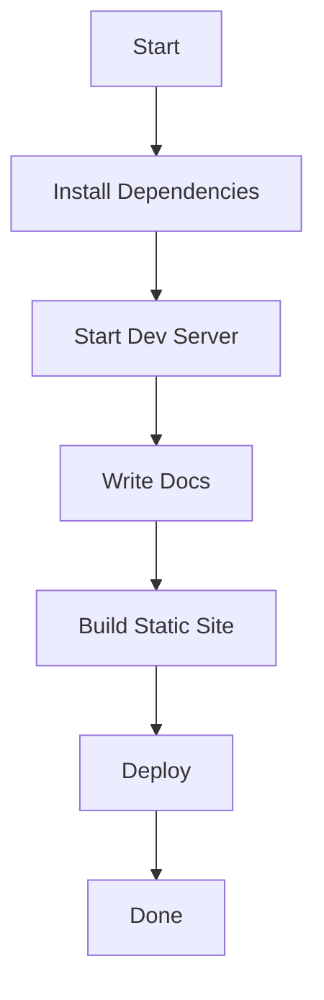
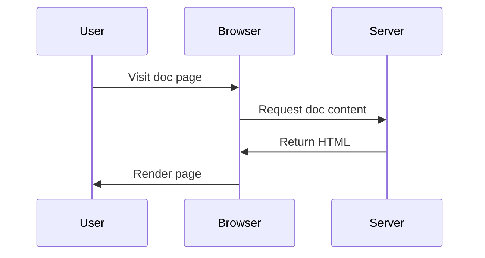
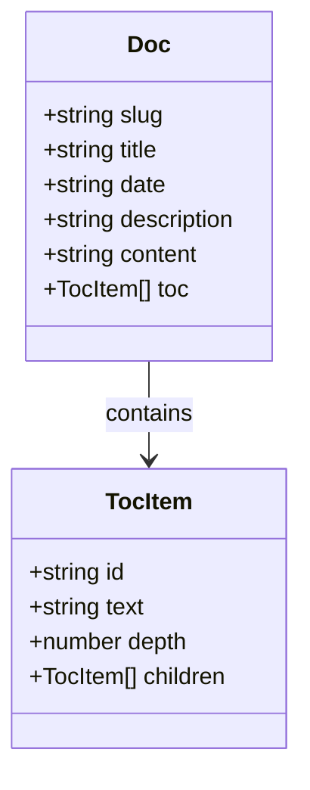

欢迎使用 docs-app 文档站点！本指南将帮助你快速了解如何使用。

## 安装

首先，确保你已安装 Node.js 20.x 或更高版本。

```bash
pnpm install
```

## 开发

启动开发服务器：

```bash
pnpm -F docs-app dev
```

访问 `http://localhost:5173` 查看站点。

## 构建

生成静态站点：

```bash
pnpm -F docs-app build
```

构建产物位于 `build/client/` 目录。

## 文档格式

每个文档使用 Markdown 格式，顶部包含 YAML frontmatter：

```yaml
---
title: 文档标题
date: 2024-01-15
description: 文档描述
---
```

## 代码高亮

支持多种语言的代码高亮：

```typescript
interface Doc {
  slug: string;
  title: string;
  content: string;
}
```

```bash
pnpm build
```

## 流程图示例

使用 Mermaid 语法绘制流程图：



## 时序图示例

使用 Mermaid 语法绘制时序图：



## 类图示例

使用 Mermaid 语法绘制类图：



---

更多信息请参考项目文档。
