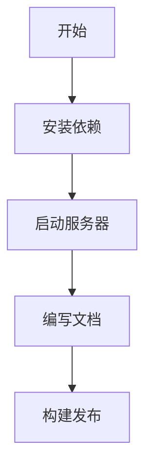

export const meta = () => [
  { title: 'Getting Started - Docs App' },
  { name: 'description', content: '开始使用 docs-app，了解基本功能和配置方法。' },
];

# Getting Started

欢迎使用 docs-app！这是一个专注于文档和手稿展示的静态站点。

## 快速开始

### 安装依赖

```bash:terminal
pnpm install
```

### 启动开发服务器

```bash:terminal
pnpm -F docs-app dev
```

## 功能特性

- MDX 格式支持
- 代码语法高亮
- Mermaid 流程图
- 暗色模式
- 响应式布局

## 代码示例

下面是一个简单的 React 组件：

```tsx:app.tsx showLineNumbers
import { useState } from 'react';

export function Counter() {
  const [count, setCount] = useState(0);

  return (
    <button onClick={() => setCount(c => c + 1)}>
      Count: {count}
    </button>
  );
}
```

## 流程图示例



---

更多内容请参考后续文档。
