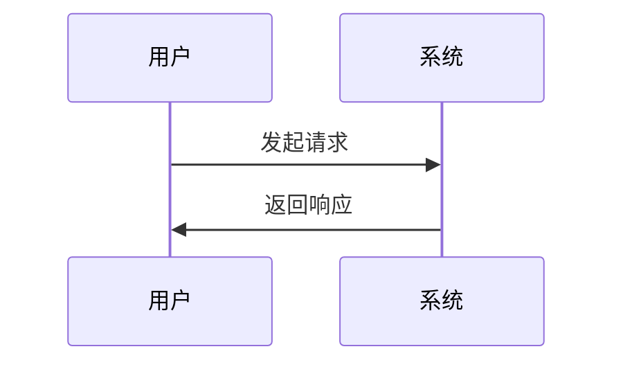

export const meta = () => [
  { title: '我的思考 - Docs App' },
  { name: 'description', content: '一些随笔和思考记录。' },
];

# 我的思考

这是我的第一篇手稿，用来记录一些想法和感悟。

## 关于写作

写作是思考的延伸。通过文字，我们可以：

- 整理思路
- 记录灵感
- 分享见解

## 关于技术

技术是工具，不是目的。学习新技术时，要记住：

> 不要为了技术而学习技术，要为了解决问题而学习技术。

## 一个简单的流程图

---

保持简单，专注本质。